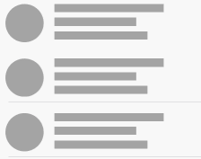
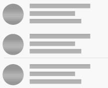
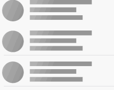

- [x] iOS 7.0+
- [x] 多样式
- [x] 轻量级，核心实现仅仅是对UIView进行扩展 
- [x] 可以自定义
- [x] 支持不同高度的cell

<table>
<tr>
<td width="25%">
<center>Solid</center>
</td>
<td width="25%">
<center>GradientHorizontal</center>
</td>
<td width="25%">
<center>GradientVertical</center>
</td>
<td width="25%">
<center>Oblique</center>
</td>
</tr>
<tr>
<td width="25%">
</img>
</td>
<td width="25%">
</img>
</td>
<td width="25%">
</img>
</td>
<td width="25%">
</img>
</td>
</tr>
</table>
 
#### <a id="somo_integrate"></a>集成
```ruby
pod 'Somo'
```
#### <a id="somo_usage"></a>使用
```objective-c
#import "Somo.h" 
```


* 当需要某一个UIView拥有Skeleton效果时，只需遵守<SomoSkeletonLayoutProtocol>协议，实现一个必要方法：
	
```objective-c
@required
/**
 *  Example:
	 SomoView * s0 = [[SomoView alloc] initWithFrame:CGRectMake(10, 20, 70, 70)];
	 SomoView * s1 = [[SomoView alloc] initWithFrame:CGRectMake(100, 30, 200, 15)];
	 SomoView * s2 = [[SomoView alloc] initWithFrame:CGRectMake(100, 70, 100, 15)];

	return @[s0,s1,s2];
 *
 @return array of SomoViews
 */
- (NSArray<SomoView *> *)somoSkeletonLayout;
```
* Somo对UIView进行了扩展，开发者调用即可拥有Skeleton效果：
```objective-c
- (void)beginSomo;
- (void)endSomo; 
```
#### <a id="somo_uitableview"></a>UITableView-skeleton
在常见场景中，数据请求未着陆前，UITableView中所有visibleCells都应该呈现skeleton效果。为了达到这种效果，

您不必再编写更多的代码。Somo中有一个遵循<UITableViewDataSource,UITableViewDelegate>协议的SomoDataSourceProvider类，

您只需要按照该类指定的初始化方法构造一个实例，数据未着陆前，将tableview实例的datasource和delegate指向构造出

的SomoDataSourceProvider实例。当数据着陆后，将tableview的datasource和delegate指向controller或其他。

* 数据着陆前：

```objective-c

//将tableview的datasource指向SomoDataSourceProvider
//当数据加载完成后，将tableview的datasource指向self

//cell高度相同时使用该方法初始化
self.provider = [SomoDataSourceProvider dataSourceProviderWithCellReuseIdentifier:@"id"];
 
//cell高度不同时
 
self.provider = [[SomoDataSourceProvider alloc] initWithTableViewCellBlock:^UITableViewCell<SomoSkeletonLayoutProtocol> *(UITableView *tableView, NSIndexPath *indexPath) {
		if(indexPath.row%2 == 0){
			return [tableView dequeueReusableCellWithIdentifier:@"id" forIndexPath:indexPath];
		}else{
			return [tableView dequeueReusableCellWithIdentifier:@"oid" forIndexPath:indexPath];
		} 
	} heightBlock:^CGFloat(UITableView *tableview, NSIndexPath *indexPath) {
		if(indexPath.row%2 == 0){
			return 120;
		}else{
			return 80;
		}
	}];
	
self.tableView.dataSource = self.provider;
self.tableView.delegate = self.provider;
```
* 数据着陆后：
```objective-c
#pragma mark - 
self.tableView.dataSource = self;
self.tableView.delegate = self;
//============================
[self.tableView reloadData];
```
* 注意点:
不要对SomoDataSourceProvider做定制。必须实现<UITableViewDelegate>中的一个方法：
```objective-c
#pragma mark - 在这里必调用 endSomo
- (void)tableView:(UITableView *)tableView willDisplayCell:(UITableViewCell *)cell forRowAtIndexPath:(NSIndexPath *)indexPath{
	[cell endSomo];
}
``` 
	
* UICollectionView skeleton
* 数据着陆前：
```objective-c
self.provider = [SomoDataSourceProvider dataSourceProviderWithCellReuseIdentifier:@"id"];
self.collectionView.dataSource = self.provider;
self.collectionView.delegate = self.provider;
```
```objective-c
- (void)collectionView:(UICollectionView *)collectionView didEndDisplayingCell:(UICollectionViewCell *)cell forItemAtIndexPath:(NSIndexPath *)indexPath{
	[cell endSomo];
}
```


## License
[](https://app.fossa.com/projects/git%2Bgithub.com%2FHHHsiang%2FSomo?ref=badge_large)
